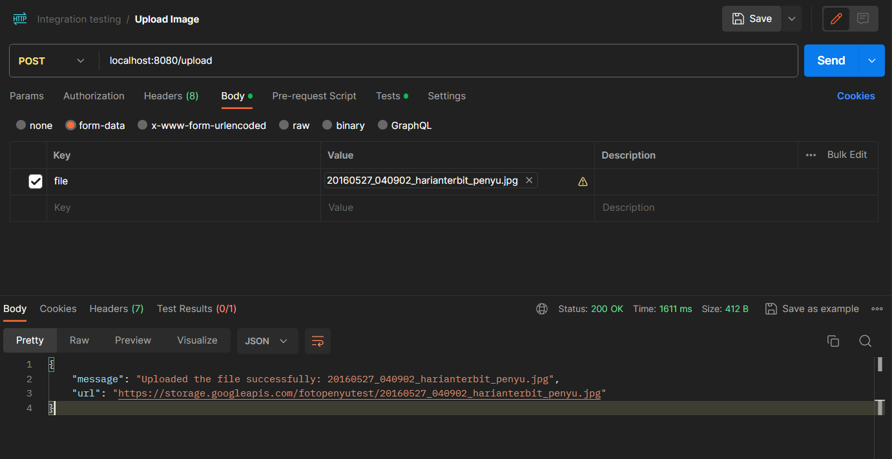

# Cloud-Computing API Documentation

* Send Feedback To Email (POST): /FeedbackEmail
* Send Feedback To Database (POST): /AddFeedback
* Fetch Data From Database (GET): /data
* Upload Image (POST): /upload
* Fetch image from cloud storage bucket: /download/{filename}

# FeedbackEmail API

Welcome to the FeedbackEmail API documentation! This API allows you to add an email along with associated text to your system, making communiaction through email easier.

## Getting Started

Before you start using the FeedbackEmail API, ensure you have the necessary environment to make HTTP requests.

### Prerequisites
- Nodemailer (Node.js module to handle sending messages through email with various method)

## Using the API

### Making a Request

To send feedback message to the developer email, make a POST request to the `/FeedbackEmail` endpoint with the following format:
```json
{
  "userEmail": "example@email.com",
  "userMessage": "Sample text associated with the email"
}
```
### Example

Json input expected for`/FeedbackEmail` endpoint:

```json
{
  "userEmail": "testingcapstone@gmail.com",
  "userMessage": "Hello, this is a test message."
}
```

# File Upload API

## Description

This API provides a simple and efficient way to upload files to a server. It's built with Node.js and uses the Multer middleware for handling `multipart/form-data`, suitable for uploading files up to 2MB in size. The files are temporarily stored in memory and then uploaded to a Google Cloud Storage bucket.

## Getting Started
Before you start using the File Upload API, make sure you have the necessary environment to handle HTTP file upload requests.

### Prerequisites

- Node.js
- Access to Google Cloud Storage
- Multer (Node.js middleware for handling multipart/form-data)
  
## Request Format
- The request should be made with multipart/form-data encoding.
- Include the file data in the field named "file".
- The file size must not exceed 2MB.
  
## Expected Output
```json
{
  "message": "Uploaded the file successfully: [file name]",
  "url": "https://storage.googleapis.com/[bucket-name]/[file name]"
}
```
## Example

